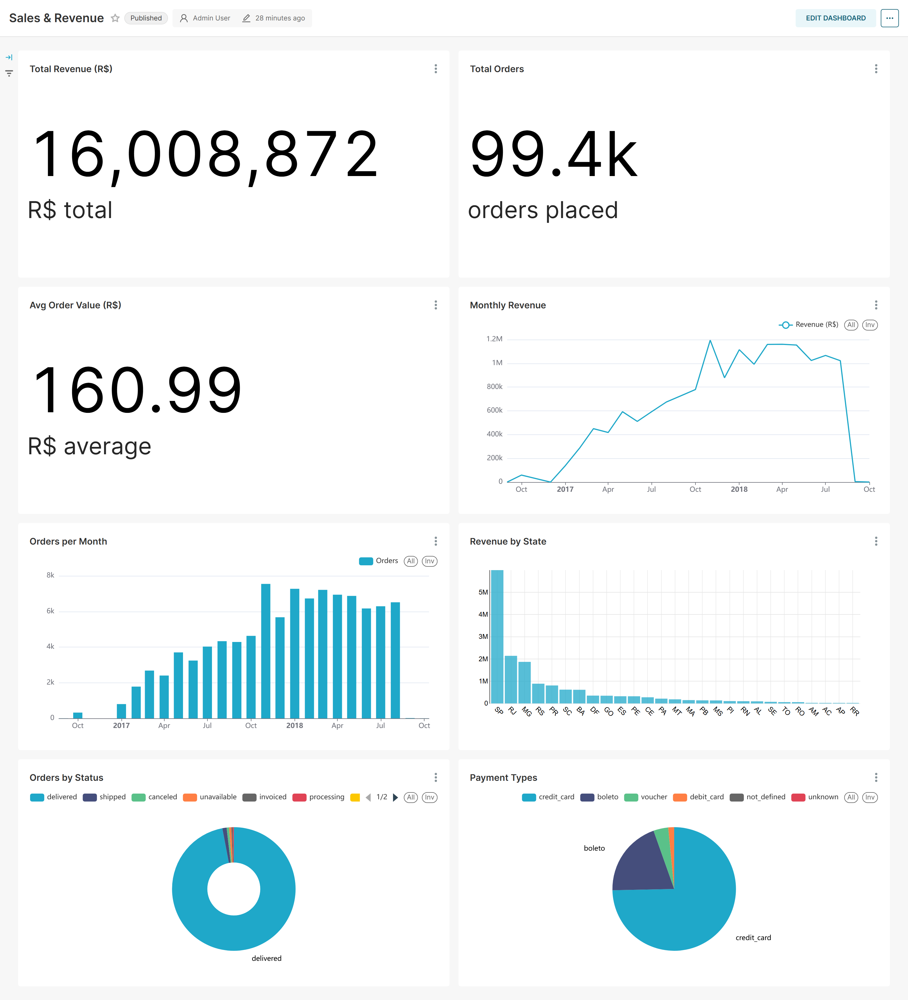
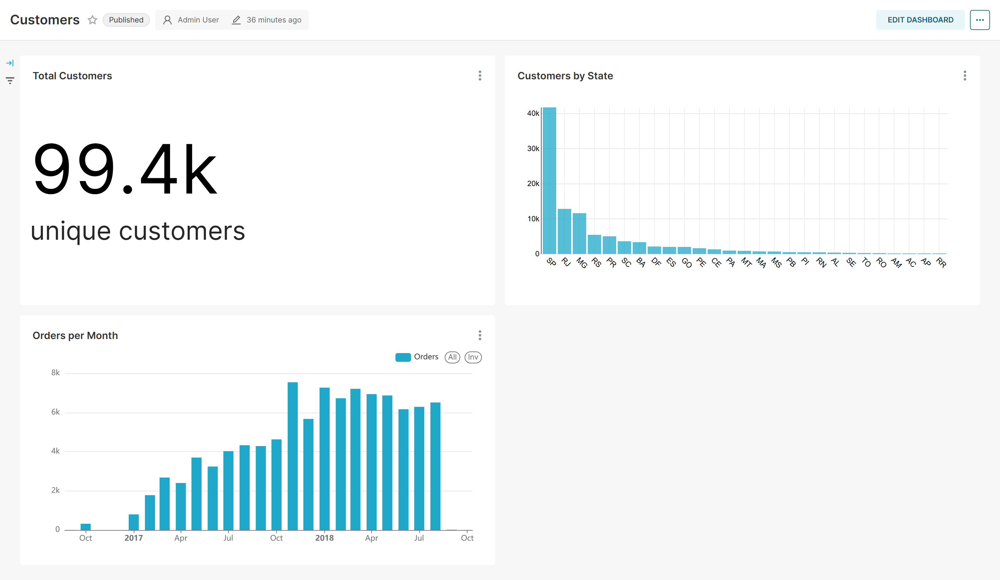
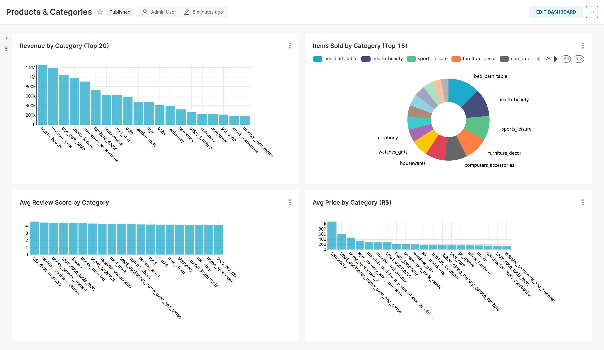
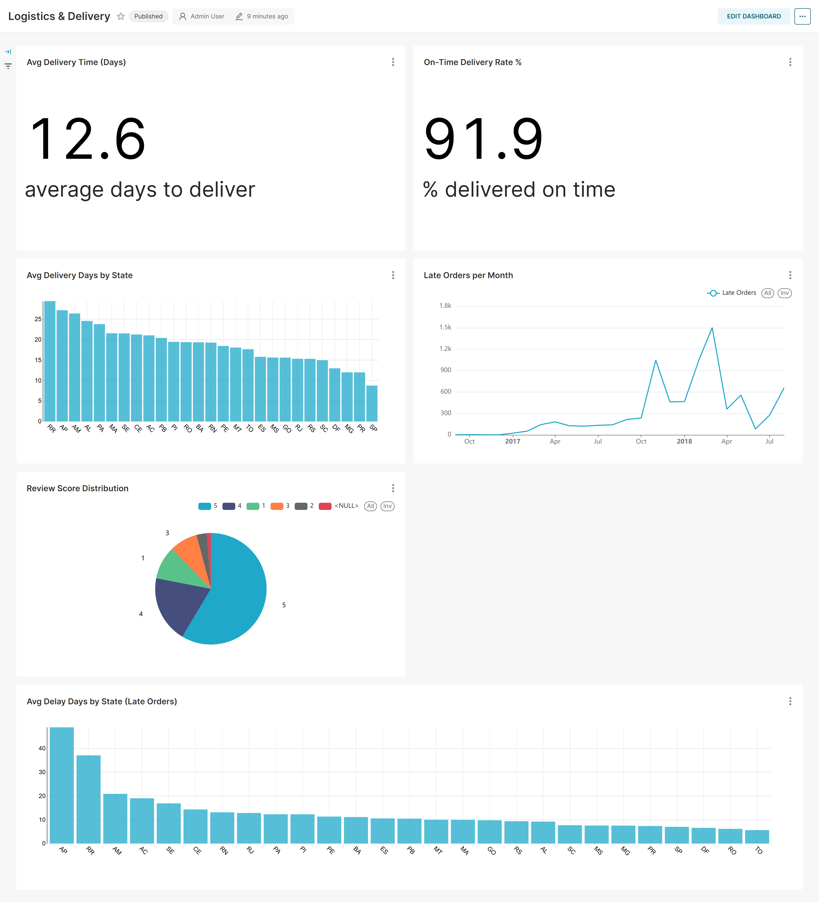

# Olist E-Commerce BI Dashboard

Business Intelligence dashboards built on the Brazilian Olist e-commerce dataset using Apache Superset, PostgreSQL, and Docker.



---

## Stack

| Layer | Technology |
|---|---|
| Visualization | Apache Superset 4.1.1 |
| Database | PostgreSQL 16 |
| Cache / Queue | Redis 7 + Celery |
| Infrastructure | Docker Compose |

---

## Dataset

[Brazilian E-Commerce Public Dataset by Olist](https://www.kaggle.com/datasets/olistbr/brazilian-ecommerce) — 100k real orders placed on the Olist marketplace between 2016 and 2018, covering customers across all 26 Brazilian states.

**Schema (9 tables):**
```
orders ──< order_items >── products >── product_category_translation
  │                          │
  ├──< order_payments       sellers
  ├──< order_reviews
  └──> customers >── geolocation
```

---

## Dashboards

### 1. Sales & Revenue


**Key metrics:** R$ 16M revenue · 99.4k orders · R$ 161 average order value

**Insights:**
- Revenue grew **+21% YoY** from R$ 7.09M (2017) to R$ 8.59M (2018), driven by organic growth with no platform changes
- **78% of payments** are made by credit card with an average installment plan of **3.5 months** — Brazilian consumers strongly prefer splitting large purchases
- Monthly order volume peaks at **7k+ orders** in mid-2018, with a sharp drop in late 2018 indicating the dataset cutoff (not a business decline)
- `delivered` status accounts for **96.9%** of all orders, confirming high operational reliability

---

### 2. Customers



**Key metrics:** 99.4k unique customers · consistent month-over-month growth

**Insights:**
- **São Paulo alone = 41% of all orders** (41k out of 99k) — the Southeast region (SP + RJ + MG) drives **66% of total volume**
- The North and Northeast regions (BA, CE, PE, MA…) represent ~28% of Brazil's population but only ~10% of orders — a significant untapped market
- Customer acquisition shows a **clear upward trend** throughout 2017–2018 with no plateau, suggesting growth was still accelerating at dataset end

---

### 3. Products & Categories



**Key metrics:** 73 product categories · health_beauty leads by revenue

**Insights:**
- **Top 5 categories by revenue:**

  | Category | Revenue | Avg Review |
  |---|---|---|
  | health_beauty | R$ 1.26M | ⭐ 4.15 |
  | watches_gifts | R$ 1.20M | ⭐ 4.03 |
  | bed_bath_table | R$ 1.04M | ⭐ 3.90 |
  | sports_leisure | R$ 0.98M | ⭐ 4.12 |
  | computers_accessories | R$ 0.91M | ⭐ 3.95 |

- **health_beauty** is the standout: highest revenue AND highest satisfaction score — ideal candidate for increased ad spend or seller acquisition
- **bed_bath_table** scores the lowest review average among top-5 (3.90) despite high volume — likely a quality or fragile-goods packaging issue worth investigating
- Price range varies enormously across categories — watches_gifts has high revenue from fewer, higher-priced items

---

### 4. Logistics & Delivery



**Key metrics:** 12.6 days avg delivery · 91.9% on-time rate

**Insights:**
- **Delivery time is the strongest driver of customer satisfaction.** Late orders score an average of **2.56 stars** vs **4.30 stars** for on-time deliveries — a gap of 1.74 points on a 5-point scale:

  | Delivery | Avg Review Score |
  |---|---|
  | On time | ⭐ 4.30 |
  | Late | ⭐ 2.56 |

- **Geographic delivery inequality is severe.** The Amazon/North region is 3× slower than São Paulo:

  | State | Avg Days | On-Time % |
  |---|---|---|
  | RR (Roraima) | 29.4 | 87.8% |
  | AP (Amapá) | 27.2 | 95.5% |
  | AM (Amazonas) | 26.4 | 95.9% |
  | AL (Alagoas) | 24.5 | **76.1%** |
  | SP (São Paulo) | 8.8 | ~97% |

- **Alagoas (AL) is the critical outlier:** 24.5 avg days AND only 76.1% on-time rate — the worst accuracy despite not being the most geographically isolated state, suggesting a logistics partner issue rather than a distance issue
- Late orders spike in **Nov–Dec 2017** (holiday season) and again in **early 2018**, pointing to capacity constraints during peak demand
- **57.8% of customers rate 5 stars**, but **11.5% rate 1 star** — a bimodal distribution typical of e-commerce where most experiences are either great or very poor

---

## Key Business Recommendations

1. **Fix AL logistics partner** — 76.1% on-time rate in Alagoas is an operational failure, not a geography problem. Switching carrier or adding a regional hub should be the first priority.
2. **Set realistic delivery estimates for the North** — AP and AM have 95%+ on-time rates despite 27+ day averages because estimates are already padded. Apply the same strategy to MA and RN where on-time rates are below 83%.
3. **Double down on health_beauty** — it's the only top-5 category combining high revenue with high customer satisfaction.
4. **Investigate bed_bath_table quality** — 3.90 avg review at R$ 1M+ revenue suggests packaging or product issues that are quietly eroding brand trust.

---

## Project Structure

```
bi-project/
├── docker-compose.yml        # Superset + PostgreSQL + Redis + Celery
├── Dockerfile                # Custom Superset image
├── superset_config.py        # Superset configuration
├── .env                      # Environment variables
├── init.sh                   # Container initialization script
├── setup_superset.py         # Creates all datasets, charts and dashboards via API
├── fix_dashboards.py         # Utility: re-links charts to dashboards
├── screenshots/              # Dashboard screenshots
│   ├── 01_sales_revenue.png
│   ├── 02_customers.png
│   ├── 03_products_categories.png
│   └── 04_logistics_delivery.png
└── README.md
```

---

## Quick Start

**Prerequisites:** Docker Desktop, PostgreSQL with the `olist_ecommerce` database loaded.

```bash
# 1. Clone the repo
git clone <your-repo-url>
cd bi-project

# 2. Start all services
docker compose up -d

# 3. Wait ~30 seconds, then open Superset
open http://localhost:8088
# Login: admin / admin123

# 4. (Optional) Re-create all dashboards programmatically
python setup_superset.py
```

**olist_ecommerce database** — load the dataset from [Kaggle](https://www.kaggle.com/datasets/olistbr/brazilian-ecommerce) into a local PostgreSQL instance on port 5432 under the `olist` schema.

---

## Data Model

Virtual datasets used for dashboards:

| Dataset | Description |
|---|---|
| `orders_enriched` | Orders joined with customers and payments — base for Sales & Customers dashboards |
| `delivery_metrics` | Delivered orders with computed `actual_delivery_days`, `delay_days`, `is_late` flags |
| `products_enriched` | Order items joined with products, categories (translated), reviews, and orders |
